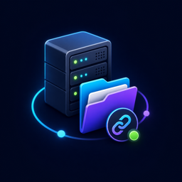

# Easy VPS

Browse and manage VPS files directly in the VS Code Explorer over SSH/SFTP—without working through a terminal.

## Why Easy VPS?

Easy VPS gives remote servers the same familiar file-management experience as a local workspace. Open and edit files, create folders, rename or move items, and delete remote content directly from Explorer.

## Features

- Two-step setup: enter `user@host`, then your password.
- Dedicated Easy VPS sidebar with saved servers.
- Password and SSH private-key authentication.
- Read, edit, create, rename, copy, move, and delete remote files and folders.
- One-click shortcuts for `/`, `/root`, `/home`, `/var/www`, `/etc`, `/opt`, `/srv`, and `/tmp`.
- Parent-folder (`..`) navigation for remote paths.
- One Explorer entry per VPS, even when changing remote paths.
- Import profiles from `~/.ssh/config`.
- Test, edit, reconnect, refresh, remove, or forget connections.
- Automatic reconnection after restarting or reloading the editor.
- Passwords stored with VS Code Secret Storage—not in settings or profile files.

## Installation

Open Extensions in VS Code, search for **Easy VPS**, and select **Install**.

The extension identifier is `moncefazzouz.easy-vps`.

## Quick start

1. Click the **Easy VPS** server icon in the Activity Bar.
2. Click **Add VPS**.
3. Enter an SSH address such as `root@203.0.113.10`.
4. Enter the SSH password.
5. Expand the server and choose `/` or another shortcut.

The VPS appears in Explorer. Expand it and work with the files like a normal workspace folder.

Port `22` and remote path `/` are automatic in the quick flow. For a custom port, remote directory, or private key, run **Easy VPS: Add VPS (Advanced)** from the Command Palette.

## Using the sidebar

Expand a saved server to access common paths. Selecting a path reveals it inside the existing VPS entry in Explorer—it does not create duplicate workspace folders.

Right-click a saved server to:

- Open it in Explorer
- Test the connection
- Edit its name or default remote path
- Forget the saved connection

Right-click a VPS entry in Explorer and choose **Remove VPS from Explorer** to hide it without deleting its saved connection.

## SSH config import

Run **Easy VPS: Import from SSH Config** to import compatible hosts from `~/.ssh/config`. Host name, user, port, and identity-file values are recognized.

## Security

- Passwords are stored using VS Code's encrypted Secret Storage.
- Connection metadata—host, user, port, path, and private-key location—is stored in extension global state.
- SSH keys are recommended for production servers.
- Easy VPS does not currently confirm new server host-key fingerprints. Only connect to servers you trust and verify sensitive servers through another trusted SSH client first.

## Commands

- **Easy VPS: Add VPS**
- **Easy VPS: Add VPS (Advanced)**
- **Easy VPS: Connect to VPS**
- **Easy VPS: Import from SSH Config**
- **Easy VPS: Test Connection**
- **Easy VPS: Edit Connection**
- **Easy VPS: Disconnect VPS**
- **Easy VPS: Remove VPS from Explorer**
- **Easy VPS: Forget Saved Connection**

## Current limitations

- SFTP has no standard live file-watching protocol. Refresh Explorer to see changes made outside the editor.
- Copying or moving files between different VPS connections is not supported yet.
- Symlinked directories may have limited Explorer behavior.
- Easy VPS provides file access only; terminals, remote debugging, and remote language servers are outside its scope.

## Issues and source code

Report problems or contribute at [github.com/MoncefAzzouz/easy-access-vps](https://github.com/MoncefAzzouz/easy-access-vps).
